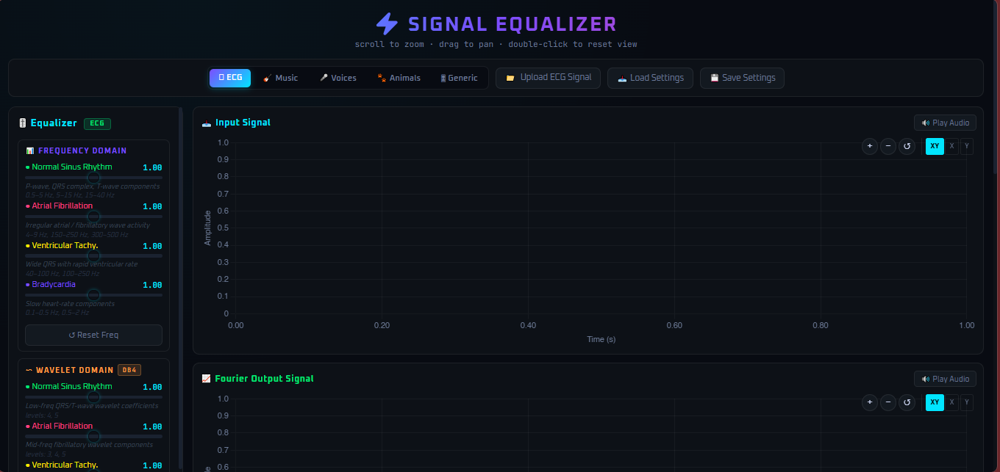
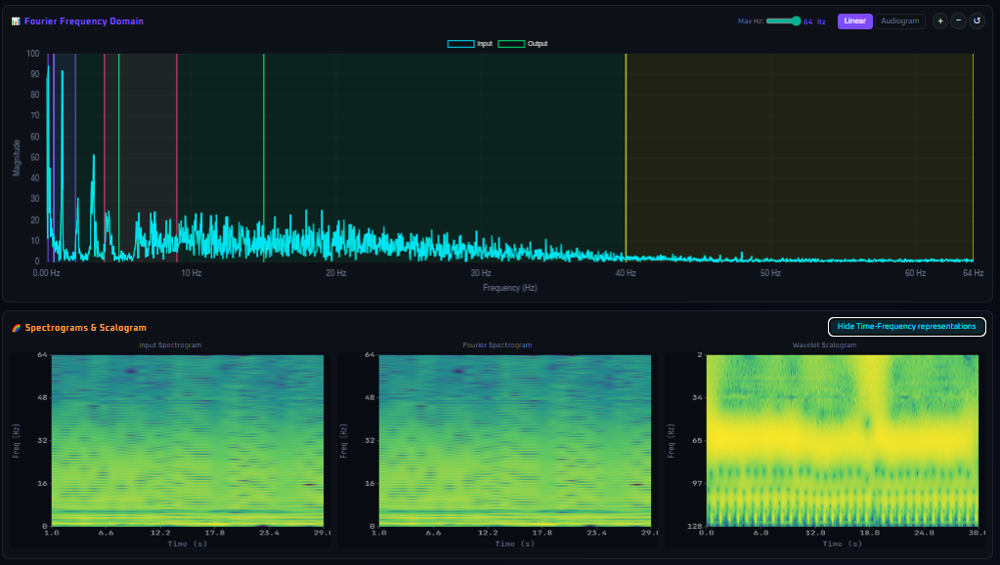
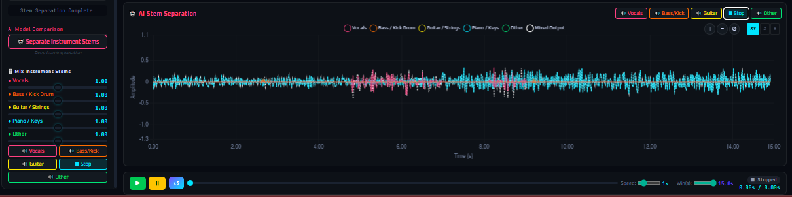
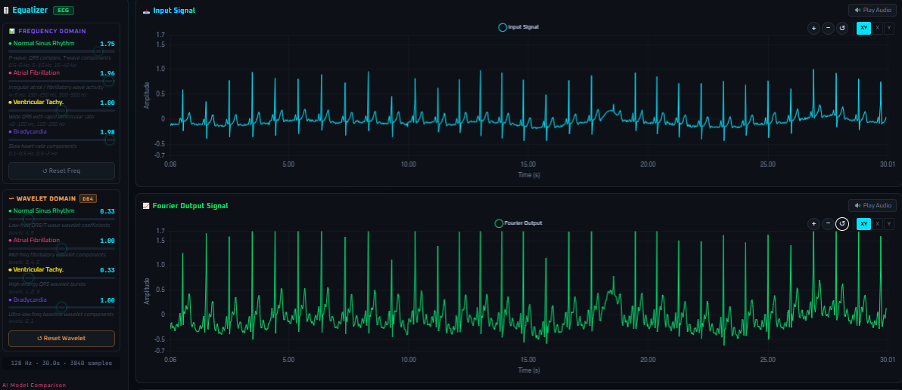

# 🎛️ Signal Equalizer

A dual-domain signal equalizer with AI-powered source separation, built with Flask and a dark-themed web UI. Supports ECG biomedical signals, music, voice, and animal audio — processed via FFT, wavelet transforms, and deep learning models.

---

## ✨ Features

- **5 Signal Modes** — ECG, Music, Voices, Animals, and Generic
- **Dual-Domain Equalization** — FFT-based filtering and wavelet denoising (mode-optimized wavelets)
- **AI Denoising & Source Separation**
  - ECG: Fully Convolutional Denoising Autoencoder (FCN-DAE) via TensorFlow/Keras
  - Music: Stem separation (drums, bass, vocals, guitar, piano, other) via [Demucs](https://github.com/facebookresearch/demucs)
  - Voices: Male/female speaker separation via [SpeechBrain SepFormer](https://speechbrain.github.io/)
  - Animals: Dog, bird, cat, frog isolation via [AudioSep](https://github.com/Audio-AGI/AudioSep) with text-query inference
- **Interactive Visualizations** — Time-domain waveforms, FFT spectrum, spectrogram, and CWT scalogram
- **Stem Mixer** — Per-stem gain sliders for music, voice, and animal modes
- **Audio Playback** — Listen to original, filtered, and separated audio directly in the browser
- **Settings Persistence** — Save and load equalizer presets as JSON

---

## 📸 Screenshots


*Main dashboard with signal loaded and waveform displayed*


*FFT spectrum and spectrogram view*


*AI stem separation panel with per-stem gain sliders*


*Before/after comparison — input vs. denoised output*

---

## 🖥️ Tech Stack

| Layer | Technology |
|---|---|
| Backend | Python, Flask |
| Signal Processing | NumPy, SciPy, PyWavelets |
| AI — ECG | TensorFlow / Keras |
| AI — Music | Demucs (PyTorch) |
| AI — Voices | SpeechBrain, Torchaudio, Librosa |
| AI — Animals | AudioSep (PyTorch) |
| Frontend | Vanilla JS, Chart.js |

---

## 📁 Project Structure

```
signal-equalizer/
├── app.py           # Flask backend — all API routes and signal processing logic
├── index.html       # Single-page frontend UI
├── settings/        # Saved equalizer presets (auto-created)
└── AudioSep/        # AudioSep repo (external, see setup below)
```

---

## 🚀 Getting Started

### Prerequisites

- Python 3.9+
- `ffmpeg` (required for MP3 support via pydub/torchaudio)

### Installation

```bash
# Clone the repository
git clone https://github.com/your-username/signal-equalizer.git
cd signal-equalizer

# Install core dependencies
pip install flask numpy scipy pywavelets

# Optional — install AI backends as needed (see below)
```

> **⚠️ Note:** Pre-trained model weights are **not included** in this repository due to their large file sizes. You will need to download each model separately following the instructions below.

### AI Backend Setup (Optional)

Each AI feature requires its own set of dependencies. Install only what you need:

**ECG Denoising (TensorFlow)**
```bash
pip install tensorflow
```

**Music Separation (Demucs)**
```bash
pip install demucs torchaudio librosa
```

**Voice Separation (SpeechBrain)**
```bash
pip install speechbrain torchaudio librosa
```

**Animal Sound Separation (AudioSep)**
```bash
# Clone the AudioSep repo
git clone https://github.com/Audio-AGI/AudioSep
# Update AUDIOSEP_REPO_DIR in app.py to point to your local clone
# Download the checkpoint (1.26 GB) from HuggingFace:
# https://huggingface.co/Audio-AGI/AudioSep
# Place it at: AudioSep/checkpoint/audiosep_base_4M_steps.ckpt
pip install torch torchaudio
```

### Running the App

```bash
python app.py
```

Then open `http://localhost:5000` in your browser.

---

## 📡 API Reference

| Endpoint | Method | Description |
|---|---|---|
| `/api/upload` | POST | Upload a signal file (CSV, DAT, WAV, MP3) |
| `/api/fft_equalize` | POST | Apply FFT-based equalization |
| `/api/wavelet_equalize` | POST | Apply wavelet denoising |
| `/api/ai_denoise` | POST | Run AI denoising / source separation |
| `/api/mix_voice_stems` | POST | Adjust male/female voice stem gains |
| `/api/mix_music_stems` | POST | Adjust music stem gains |
| `/api/mix_animal_stems` | POST | Adjust animal stem gains |
| `/api/spectrogram` | GET | Retrieve spectrogram data |
| `/api/scalogram` | GET | Retrieve CWT scalogram data |
| `/api/audio` | GET | Stream processed audio as WAV |
| `/api/settings/save` | POST | Save current settings preset |
| `/api/settings/load` | POST | Load a settings preset from file |
| `/api/settings/default` | GET | Load the default ECG preset |

---

## 🎚️ Signal Modes

| Mode | Wavelet | AI Model | Stems |
|---|---|---|---|
| ECG | `sym5` | FCN-DAE (TF/Keras) | — |
| Music | `db4` | Demucs | drums, bass, vocals, guitar, piano, other |
| Voices | `haar` | SepFormer (SpeechBrain) | male, female |
| Animals | `coif3` | AudioSep | dog, bird, cat, frog, other |
| Generic | `db4` | FCN-DAE (TF/Keras) | — |

---

## 📄 Supported File Formats

- `.csv` — comma-separated signal values
- `.dat` — whitespace-separated signal values
- `.wav` — PCM audio
- `.mp3` — compressed audio (requires ffmpeg)

---

## 📝 License

This project is open source. See [LICENSE](LICENSE) for details.
